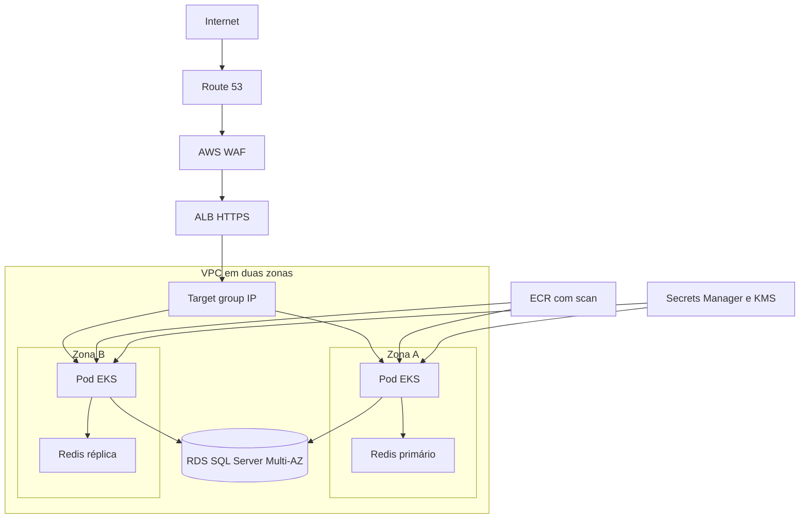

# Arquitetura

O banco e o cache permanecem em sub-redes isoladas, sem acesso público. O RDS usa failover Multi-AZ e senha mestre gerenciada pelo RDS; Redis é um cache com réplica e failover, não uma fonte de verdade.

