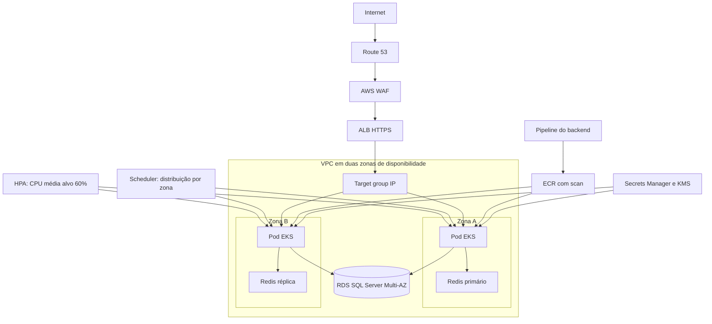

# Arquitetura

## Fronteiras e disponibilidade

O banco e o cache permanecem em sub-redes isoladas, sem acesso público. O RDS usa failover Multi-AZ e senha mestre gerenciada pelo RDS; Redis é um cache com réplica e failover, não uma fonte de verdade. O ALB, EKS, NAT e Redis são distribuídos entre duas zonas.

O fluxo de entrega é: pipeline do backend publica uma imagem imutável no ECR; o deployment no EKS usa ao menos duas réplicas, HPA e `/health`; o `TargetGroupBinding` registra os pods saudáveis no target group do ALB.

## Mapa da configuração Terraform

A configuração é um único módulo raiz, dividido por domínio. `provider.tf` fornece o contexto comum; `network.tf` fornece a VPC; `security.tf` define criptografia e conectividade; `registry.tf`, `eks.tf`, `data.tf` e `edge.tf` fornecem os serviços de imagem, computação, dados e borda.

O bloco `module "vpc"` consome `terraform-aws-modules/vpc/aws`. O código baixado em `.terraform/modules/vpc` é somente cache de dependência local e não deve ser tratado como parte desta arquitetura nem enviado ao repositório.

Para visualizadores que recebem o conteúdo Mermaid diretamente, use [architecture.mmd](architecture.mmd). O arquivo não contém Markdown nem cercas de código.
## Autoscaling de pods

O HPA mantém de 2 a 6 pods do `tracking-api` no namespace `tracking`, buscando CPU média de 60%. A política permite crescimento de até dois pods por minuto e usa janela de estabilização de cinco minutos para redução.

O patch de Deployment define `topologySpreadConstraints` por `topology.kubernetes.io/zone`, com `maxSkew: 1` e `DoNotSchedule`. Assim, com capacidade disponível, o scheduler mantém os pods equilibrados entre as duas zonas.

