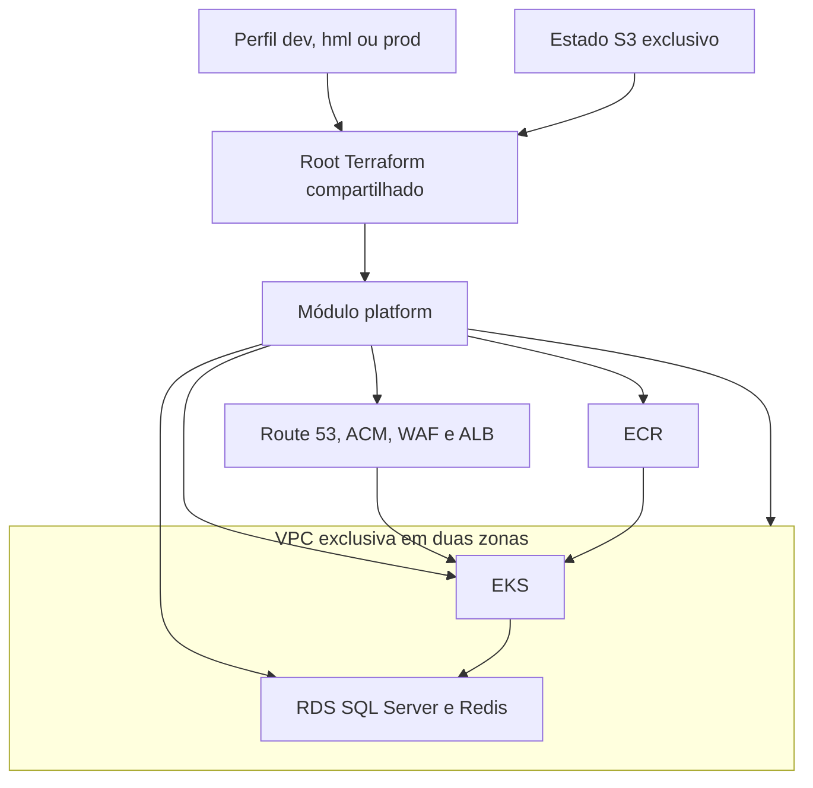

# Arquitetura multiambiente

## Isolamento

Cada ambiente possui recursos, nomes, DNS, CIDR e estado próprios. A separação de estado impede que um plano de dev altere recursos de hml ou prod. Os três ambientes ficam na mesma conta e região AWS, mas não compartilham VPC, banco, cache, cluster ou registry.

| Ambiente | CIDR | Estado | Endpoint |
| --- | --- | --- | --- |
| dev | `10.40.0.0/16` | `tracking/dev/terraform.tfstate` | `api-dev.<zona>` |
| hml | `10.50.0.0/16` | `tracking/hml/terraform.tfstate` | `api-hml.<zona>` |
| prod | `10.60.0.0/16` | `tracking/prod/terraform.tfstate` | `api.<zona>` |

## Disponibilidade e custo

Todas as VPCs possuem sub-redes públicas, privadas e de dados em duas zonas. Dev e hml compartilham um NAT Gateway e executam banco e cache Single-AZ. Produção usa um NAT por zona, RDS Multi-AZ e Redis com réplica e failover.

Dev usa um node group Spot diversificado. Homologação e produção usam On-Demand. Todos usam criptografia KMS, senha do RDS no Secrets Manager, tráfego TLS no Redis, ECR imutável com scan, ALB HTTPS e regras gerenciadas do WAF.

## Fluxo de entrega

O pipeline de infraestrutura gera planos independentes para dev, hml e prod. O pipeline da aplicação deve publicar no ECR e implantar no EKS do mesmo ambiente, usando os outputs daquele estado. A promoção esperada é dev → hml → prod.
